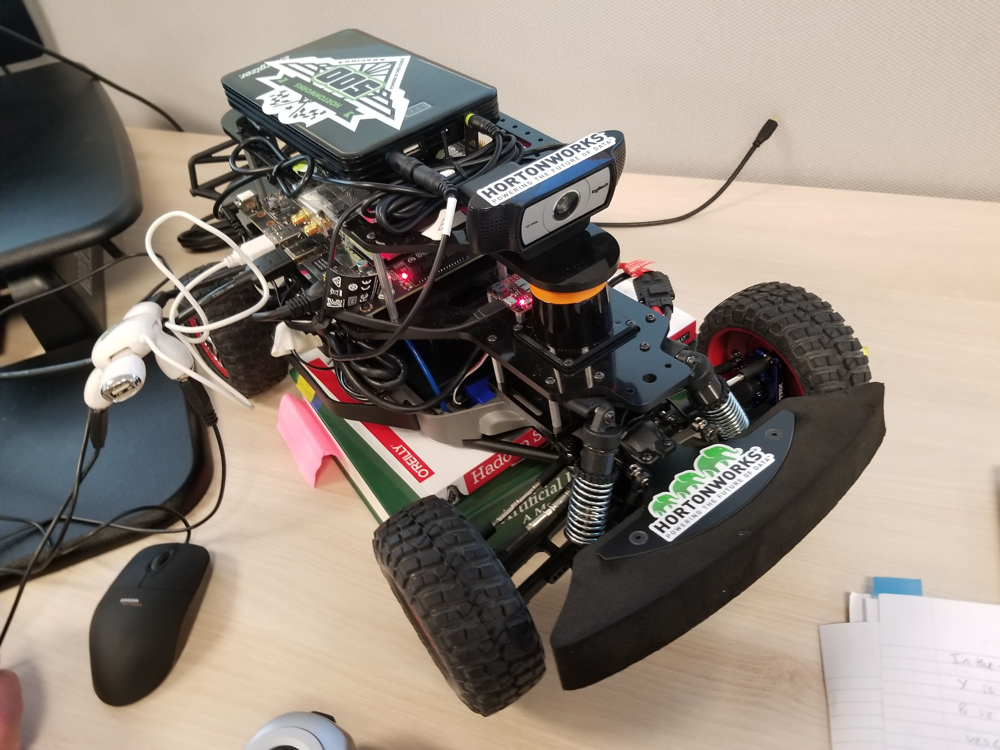
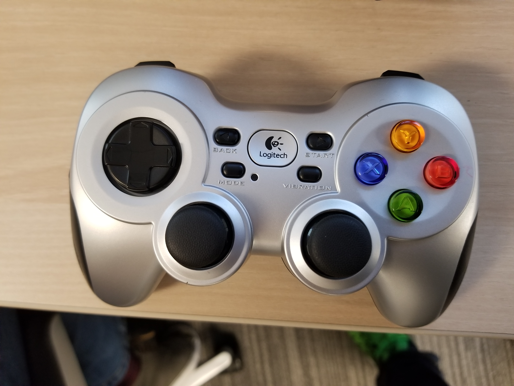

# Autonomous Car

## Intro

Autonomous Car is the Open Source version of Cloudera Self Driving Vehicle. This Driverless miniature car powered by 3D Camera, LiDAR and Game Controller connected to the Jetson TX2 Board. ROS runs on the TX2 and controls the car's movement. Keras can run on the TX2 or run on CDSW in the cloud. Training the CNN can be done on the car or in the cloud. Eventually if we have multiple cars, we could train the model on the car, then send that model to CDSW and perform federated learning. In this tutorial, we send the car data to the Hadoop HDFS in the cloud. We use CDSW to run Keras to train the model, then save the model to HDFS. The model is trained on cloning a person's driving behavior from a racetrack. The model once deployed on the car is able to predict steering angle based on center camera frames, which controls the car using ROS. Once a constant speed is passed to ROS and steering prediction is occuring, we have a driving autonomusly on our track.

In this tutorial, you will build an Edge to AI application featuring CDF and CDSW.

## Big Data Technologies used to develop the Application:

- Nvidia Jetson TX2
    - Apache MiNiFi C++ Agent
- CDF
    - CEM: Interactive UI for building MiNiFi dataflows
    - CFM: Apache NiFi
- CDH
    - Apache Hadoop - HDFS
    - CDSW: IDE for Machine Learning

## Learning Objectives

- Install MiNiFi C++ Agent onto Jetson TX2
- Understand the car sensor data from TX2
- Build a ETL Data Pipeline for data ingest with CEM for MiNiFi
- Connect MiNiFi Data Pipeline to NiFi Data Pipeline
- Connect NiFi Pipeline to Hadoop HDFS
- Mine for HDFS data in CDSW
- Train Keras CNN model in CDSW
- Save model.h5 in HDFS
- Build a NiFi Pipeline to pull in HDFS model.h5
- Send model from NiFi to MiNiFi
- Deploy model using MiNiFi

## Bill of Materials

- [Nvidia Jetson TX2 Development Kit](https://www.amazon.com/NVIDIA-945-82771-0000-000-Jetson-TX2-Development/dp/B06XPFH939)
- [Racecar/J Robot Base Kit](https://racecarj.com/products/racecar-j-robot-base-kit)

## Prerequisites

- Deployed MiNiFi C++ agent on AWS EC2 Ubuntu 18.04 instance or Jetson TX2
    - AWS: t2.micro
- Deployed CEM on AWS EC2 instance
    - AWS: CentOS7 - with Updates HVM, t3.2xlarge, All traffic - all protocol - all ports - my IP
- Deployed CDH with CDSW enabled on AWS EC2 instance
    - Add private and public DNS of CEM EC2

## Outline

- Tutorial 0: Install MiNiFi C++ on Edge
- Tutorial 1: Ingest Car Sensor Data on Edge
- Tutorial 2: Collect Car Edge Data into Cloud
- Tutorial 3: Train CNN Model in Cloud
- Tutorial 4: Deploy CNN Model onto Car

## Tutorial 0: Install MiNiFi C++ on Edge

### Option 1: Jetson TX2

### Option2: EC2 Instance

SSH on to the machine assigned to be the agent:

~~~bash
ssh -i /path/to/pem_file <os-name>@<public-dns-ipv4>
~~~

Install MiNiFi C++:

~~~bash
# MiNiFi C++ for Ubuntu 18.04
wget http://mirrors.ibiblio.org/apache/nifi/nifi-minifi-cpp/0.6.0/nifi-minifi-cpp-bionic-0.6.0-bin.tar.gz

tar -xvf nifi-minifi-cpp-bionic-0.6.0-bin.tar.gz
~~~

Open your local terminal, we will transport updated minifi.properties file from our local machine to the ec2 instance:

~~~bash
wget -O ~/Downloads/minifi.properties https://raw.githubusercontent.com/james94/Autonomous-Car/master/documentation/assets/services/minifi_cpp/minifi.properties
scp -i ~/.ssh/jmedel-aws-iam.pem ~/Downloads/minifi.properties ubuntu@<ec2-public-dns>:/home/ubuntu/nifi-minifi-cpp-0.6.0/conf
~~~

Open your ec2 instance terminal:

~~~bash
vi $HOME/nifi-minifi-cpp-0.6.0/conf/minifi.properties
~~~

Enter your public host name in these fields

~~~bash
nifi.c2.agent.coap.host=<CEM Public DNS>

nifi.c2.flow.base.url=<CEM Public DNS>:10080/efm/api

nifi.c2.rest.url=<CEM Public DNS>:10080/efm/api/c2-protocol/heartbeat

nifi.c2.rest.url.ack=<CEM Public DNS>:10080/efm/api/c2-protocol/acknowledge
~~~

Download sample driving log data for MiNiFi:

~~~bash
sudo apt -y install unzip
mkdir -p /tmp/csdv/data/input/racetrack/
cd /tmp/csdv/data/input/racetrack/
wget https://github.com/james94/Autonomous-Car/raw/master/documentation/assets/data/image.tar.gz
tar -xvf image.tar.gz
~~~

Turn on agent:

~~~bash
cd nifi-minifi-cpp-0.6.0/bin
./minifi.sh start
~~~
