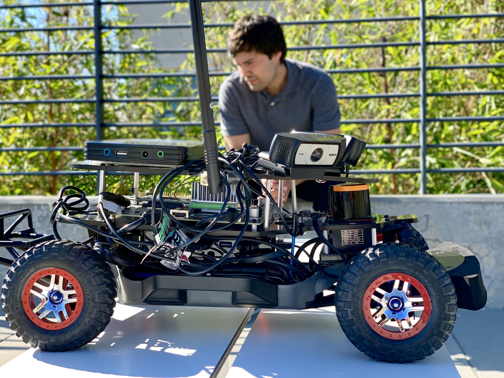

# Autonomous Car

## Intro

Autonomous Car is the Open Source version of Cloudera Self Driving Vehicle. This Driverless miniature car is powered by 3 Cameras, LiDAR and Logitech Game Controller connected to the Jetson TX2 Board. ROS runs on the TX2 and controls the car's movement. Keras can run on the TX2 or run on CDSW in the cloud. Training the CNN can be done on the car or in the cloud. Eventually if we have multiple cars, we could train the model on the car, then send that model to CDSW and perform federated learning. In this tutorial, we send the car data to the Hadoop HDFS in the cloud. We use CDSW to run Keras to train the model, then save the model to HDFS. The model is trained on cloning a person's driving behavior from a racetrack. The model once deployed on the car is able to predict steering angle based on center camera frames, which controls the car using ROS. Once a constant speed is passed to ROS and steering prediction is occuring, we have a car driving autonomusly on our track.

In this tutorial, you will build an Edge to AI application featuring CDF and CDSW.

## Big Data Technologies used to develop the Application:

- Nvidia Jetson TX2
    - [Apache MiNiFi](https://nifi.apache.org/minifi/) C++ Agent
- CDF
    - [CEM](https://docs.hortonworks.com/HDPDocuments/CEM/CEM-1.0.0/index.html): Interactive UI for building MiNiFi dataflows
    - CFM: [Apache NiFi](https://nifi.apache.org/)
- CDH
    - [Apache Hadoop](https://hadoop.apache.org/) - HDFS
    - [CDSW](https://www.cloudera.com/products/data-science-and-engineering/data-science-workbench.html): IDE for Machine Learning

## Learning Objectives

- Install MiNiFi C++ Agent onto Jetson TX2
- Understand the car sensor data from TX2
- Build a ETL Data Pipeline for data ingest with CEM for MiNiFi
- Connect MiNiFi Data Pipeline to NiFi Data Pipeline
- Connect NiFi Pipeline to Hadoop HDFS
- Mine for HDFS data in CDSW
- Train Keras CNN model in CDSW
- Save model.h5 in HDFS
- Build a NiFi Pipeline to pull in HDFS model.h5
- Send model from NiFi to MiNiFi
- Deploy model using MiNiFi

## Bill of Materials

- [Nvidia Jetson TX2 Development Kit](https://www.amazon.com/NVIDIA-945-82771-0000-000-Jetson-TX2-Development/dp/B06XPFH939)
- [Racecar/J Robot Base Kit](https://racecarj.com/products/racecar-j-robot-base-kit)