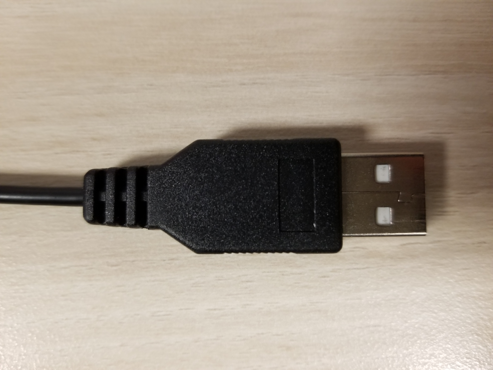

# Get the Car Moving with the Game Controller

## Introduction

You will get the car moving by using ROS and the game controller.

## Prerequisites

- make sure battery is charged
- make sure game controller wifi connector, video camera, wheels controller, IMU, keyboard and mouse are properly connected to USB hub
- make sure green cable is connected to the battery to power USB hub
- make sure black cable with blue label is connected to battery to power IMU and Jetson TX2

> Note: due to the way the USB hub was mounted to the bottom of the chassis under the Jetson Board, each USB device's connector will need to be connected with bottom facing upward.

## Launch the ROS Program to Activate Car Wheels

Run the following command in an open terminal on Jetson Ubuntu:

~~~bash
# CMD Definition: roslaunch package_name file.launch
roslaunch racecar teleop.launch
~~~

> Note: the above command activates the laser scanner, telop and wheel controls

## Control the Car Wheels with the Game Controller

Press the **Logitech** button in the center of the game controller to power it on.

Press **LB** button to take control of the car's wheels.

To move the car forward, on the direction pad, press the **UP** direction.

To move the car backward, on the direction pad, press the **DOWN** direction.

To steer left, move the **right joystick** toward the **left** direction.

To steer right, move the **right joystick** toward the **right** direction.

