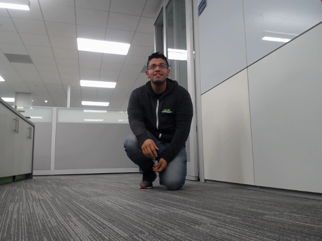
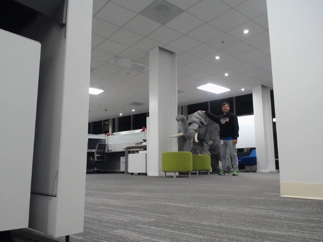

# Record Video Frames from Car with the Game Controller

## Introduction

You will get the car's real time video frames by using ROS and the game controller.

## Prerequisites

- Get the Car Moving with the Game Controller

## Launch the ROS Program to Activate Car's Video Camera

Open first terminal window:

~~~bash
# CMD Definition: roslaunch package_name file.launch
roslaunch video_stream_opencv webcam.launch
~~~

The above command launches a ROS process to open the video stream of the webcam peripheral to start publishing data.

Open second terminal window:

~~~bash
roslaunch hdp_pilot recording.launch
~~~

The above command launches a ROS process that allows the user to turn on or off recording by using the game controller.

The reason for the two commands is that the recording.launch process doesn't start the stream. Thus, you need webcam.launch to start the stream. Then run recording.launch

> Note: Python script being used to capture and store frames: **[controlRecording.py](https://gitlab.com/saumitra_bg/hdp-pilot/blob/master/hdp_pilot/scripts/controlRecording.py)**

When reading through the python script, you will see the video frames are being saved to the following directory on the Jetson: `/media/nvidia/data/images/`.

## Record Video Frames of Objects in Front of the Car

While the ROS recording process is running, there is the teleop ROS process running too. Thus, you can control the car's movements while capturing video frames.

On the game controller, press **Y** button to record video frames of objects in front of the car's camera.

On the game controller, press **B** button to stop recording video frames of objects in front of the car's camera.

It is important for the car to recognize people, so it knows either to avoid them while self driving or stop completely.

Here are two examples of different people:

**Figure 1:** Person 1

**Figure 2:** Person 2

## Further Reading

- [roslaunch](http://wiki.ros.org/roslaunch)
