# Smart Car Tutorial

## Collect Training Data

The Cloudera Self Driving Vehicle (CSDV) is a miniature autonomous car which is trained to follow markers along a race track, the team achieved this by rapidly sampling photographs and using them to run inference to adjust the steering angle of the vehicle.

The point of the exercise is to demonstrate the Edge to AI life cycle for fast model deployment to the Jetson TX2 module aboard the miniature car. The car takes advantage of Cloudera Edge Manager (CEM) to continue gathering data and improve the model.

The clip below is an example of CSDV driving autonomously around it's racetrack

## Introduction

The variety of edge devices--whether it be IoT devices, Cloud VMs, or even containers--generating data in today's industry continues to diversify and can lead to data being lost. There is a need to author flows across all variety of edge devices running across an organization; further, there is a need to monitor the published across all devices without writing customized applications for all the different types of devices. CEM provides you with an interface to author flows and monitor them with ease. CEM is made up of a few components, namely Edge Flow Manager (EFM), and MiNifi. EFM provides you with a familiar user interface, similar to NiFi's, while MiNifi is used as the tool which helps you retrieve data from hard to reach places.

CEM also allows you to granularly deploy models to every different type of device in your enterprise

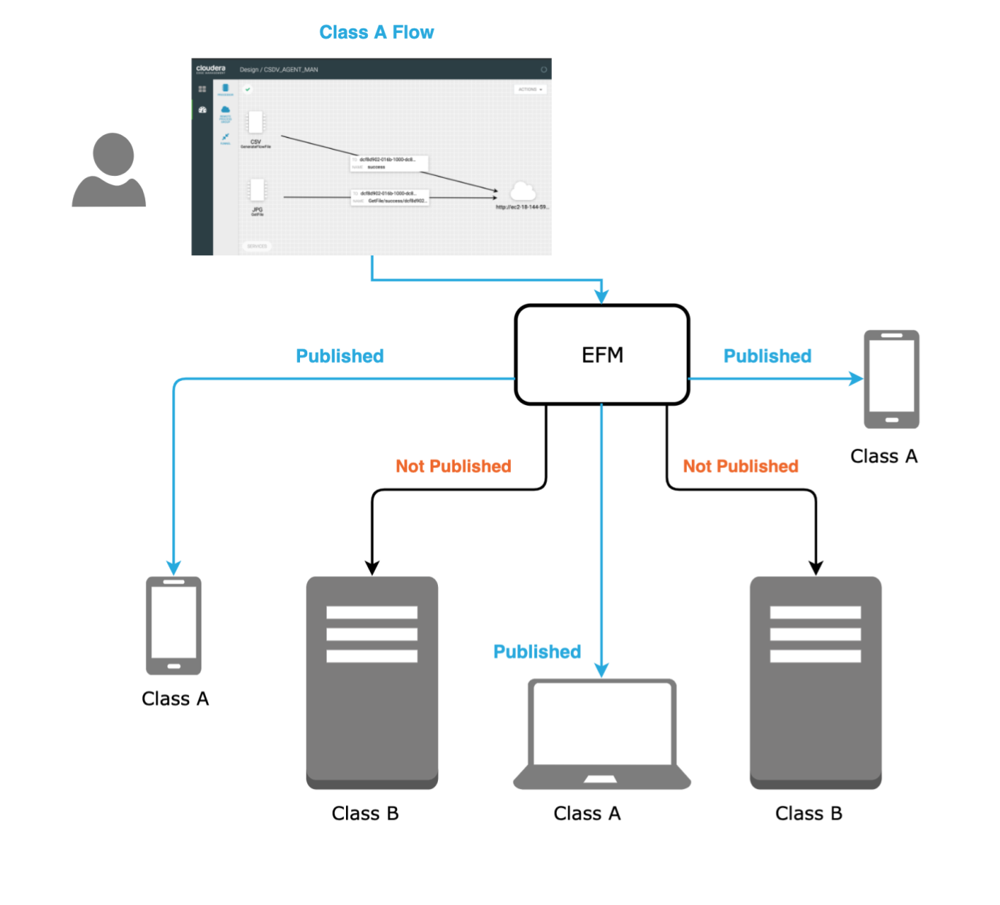

## Prerequisites

- Deployed MiNiFi C++ agent on AWS EC2 Ubuntu 18.04 instance
  - AWS: t2.micro or similar as a minimum
- Deployed CEM on a Cloudera DataFlow cluster
- Deployed a CDH Cluster with CDSW

## Concepts

We will use Cloudera Edge Manager (CEM) to build a MiNiFi dataflow in the interactive UI and publish it to the MiNiFi agent running on the edge. This dataflow will ingest the car sensor data coming from ROS and push it to NiFi running in the cloud. In this tutorial you will simulate having our Smart Car by using a cloud VM--we instruct you to use AWS but feel free to use your favorite public cloud provider--which will serve as the MiNiFi agent.

To build out this pipeline we used three Virtual Machines in AWS

| Name | Service used  | Size  | OS |
|:---|:---|:---|:---|
|Edge-Smart Car|MiNiFi|t2.micro| Ubuntu 18.04 |
|Cloudera DataFlow|CEM|m5.2xlarge|Centos 7|
|Cloudera Data Platform|HDFS + CDSW|m5.4xlarge|Centos 7|

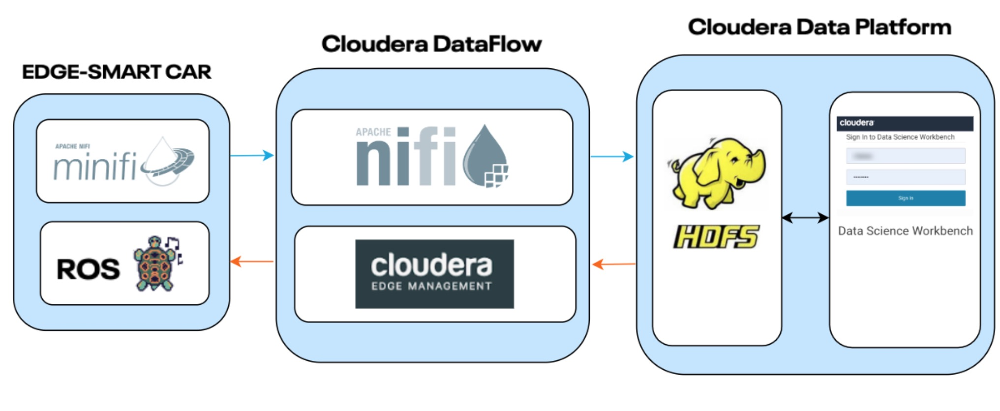

## Build Data Flow for MiNiFi via CEM UI

To begin you will need the training data on the MiNiFi agent instance, ssh onto that instance as download the data

~~~bash
mkdir -p /tmp/csdv/data/input/racetrack/image/ && wget -O /tmp/csdv/data/input/racetrack/image/image.tar.gz https://github.com/gdeleon5/Autonomous-Car/blob/master/documentation/assets/data/image.tar.gz

tar -xvzf /tmp/csdv/data/input/racetrack/image/image.tar.gz
~~~

to change your MiNiFi configurations, if you are working with a new MiNiFi Agent copy these configuration by downloading them directly to the machine running MiNiFi

~~~bash
wget -O /home/ubuntu/nifi-minifi-cpp-0.6.0/conf/minifi.properties https://raw.githubusercontent.com/gdeleon5/Autonomous-Car/master/documentation/assets/services/minifi_cpp/minifi.properties
~~~

or by downloading them onto your local computer and sending them to the agent

~~~bash
wget -O ~/Downloads/minifi.properties https://raw.githubusercontent.com/gdeleon5/Autonomous-Car/master/documentation/assets/services/minifi_cpp/minifi.properties

scp -i /path/tp/pem ~/Downloads/minifi.properties <os-name>@<ec2-public-dns>:/home/ubuntu/nifi-minifi-cpp-0.6.0/conf
~~~

Edit the following properties of the minifi.properties file:

**Table 0:** Update **minifi.properties**

| Property  | Value  |
|:---|:---|
| `nifi.c2.agent.coap.host`  | `cem-public-DNS`  |
| `nifi.c2.flow.base.url`  | `http://cem-public-DNS:10080/efm/api`  |
| `nifi.c2.rest.url`  | `http://cem-public-DNS:10080/efm/api/c2-protocol/heartbeat`  |
| `nifi.c2.rest.url.ack`  | `http://cem-public-DNS:10080/efm/api/c2-protocol/acknowledge`  |
| `nifi.c2.agent.class` | `AWS_agent` |
| `nifi.c2.agent.identifier`|`AWS_AGENT_001`|

Open your CEM UI at `<cem-public-DNS:10080/efm>`, if your `minifi.properties` configuration file is setup correctly you will find that your agent is sending heartbeats to the monitor events section of CEM UI

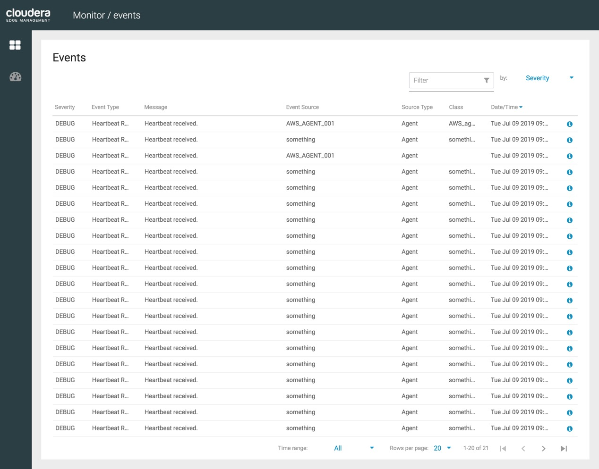

Now we know that our Agent can communicate with CEM, that is great news. In order to connect MiNiFi to NiFi we need to know where we are going so let's create a path for our data to slowly build a flow. Open NiFi UI on your CDF cluster and create a new input source named `AWS_MiNiFi_CSV` leave it alone for now, we will need the input id to set our connection from MiNiFi processor to NiFi Remote Process Group (RPG)

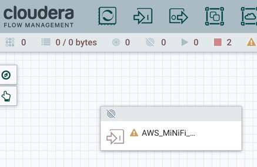

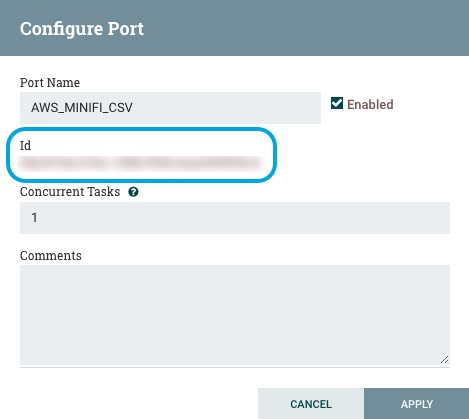

That is all we need to do on NiFi for now. Navigate to the Flow Designer on CEM UI, you can click on the class associated with MiNiFi agent you want to build the dataflow for, note that we named our agent `AWS_AGENT_001` and our class `AWS_AGENT`

> Note: Later when MiNiFi C++ agent deployed on separate the Jetson TX2, the class called **"CSDV_agent"** will appear.

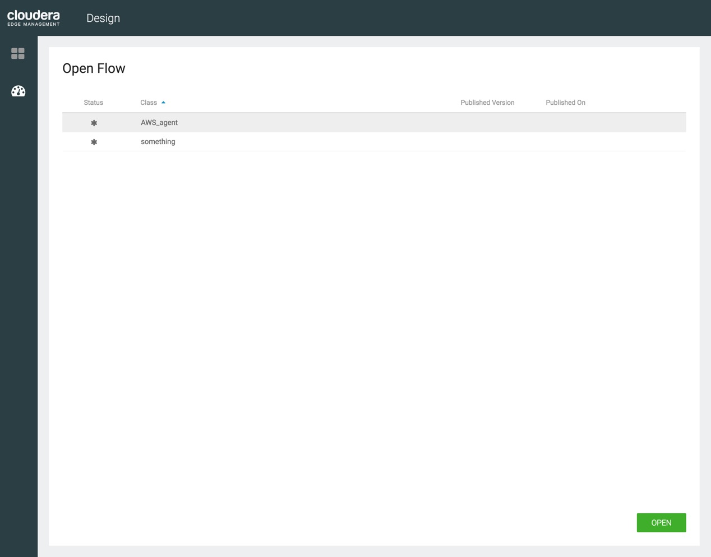

For now click class **AWS_agent**. Press open to start building. The canvas opens for building flow for class **AWS_agent**:

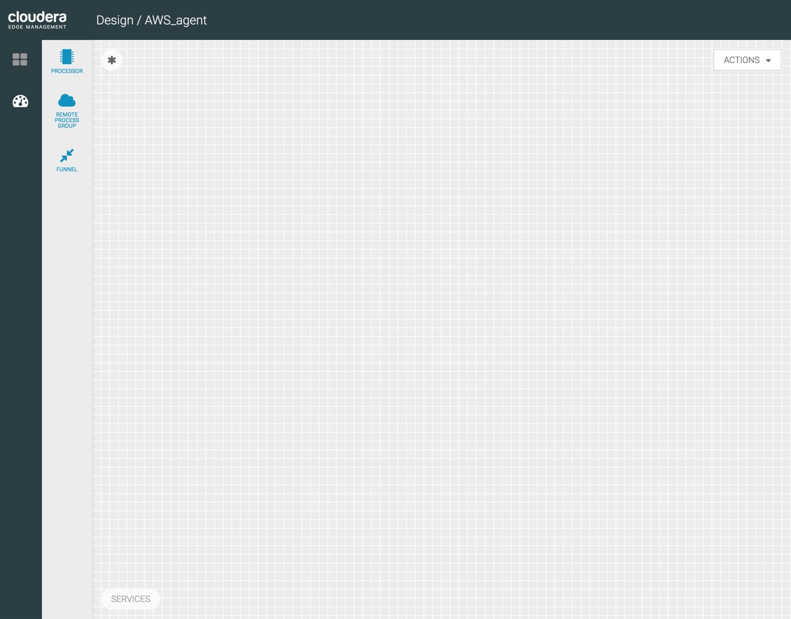

We will build a MiNiFi ETL pipeline to ingest csv and image data.

### Add a GetFile for CSV Data Ingest

Add a **GetFile** processor onto canvas to get csv data:

Update processor name to **GetCSVFile**.

Double click on GetFile to configure. Scroll to **Properties**, add the properties in Table 1 to update GetFile's properties.

**Table 1:** Update **GetCSVFile** Properties

| Property  | Value  |
|:---|:---|
| `Input Directory`  | `/tmp/csdv/data/input/racetrack/image`  |
| `Keep Source File`  | `false`  |
| `Batch Size`      | `1` |

### Push CSV Data to Remote NiFi Instance

Add a **Remote Process Group** onto canvas to send csv data to NiFi remote instance:

Add URL NiFi is running on:

| Settings  | Value  |
|:---|---:|
| `URL` | `http://<nifi-public-DNS>:8080/nifi/` |

Connect **GetCSVFile** to Remote Process Group, then add the NiFi destination input port ID you want to send the csv data:

| Settings  | Value  |
|:---|---:|
| `Destination Input Port ID` | `<NiFi-input-port-ID>` |

> Note: you can find the input port ID by clicking on your input port in the NiFi flow. Make sure you connect to the input port that sends csv data to HDFS.

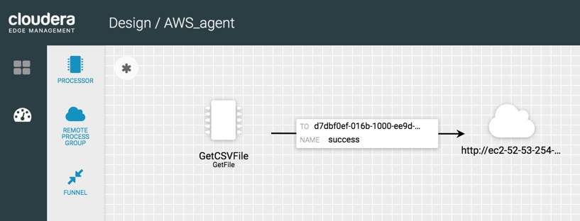

### Add a GetFile for Image Data Ingest

Add a separate inport port on NiFi UI and name it `AWS_AGENT_JPG` just like before leave it blank for now.
Now change to your CEM UI and add a **GetFile** processor onto canvas to get image data:

Update processor name to **GetImageFiles**.

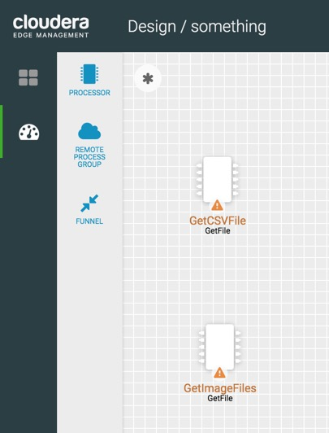

Double click on GetFile to configure. Scroll to **Properties**, add the properties in Table 2 to update GetFile's properties.

**Table 2:** Update **GetFile** Properties

| Property  | Value  |
|:---|---:|
| `Input Directory`  | `/tmp/csdv/data/input/racetrack/image/logitech`  |
| `Keep Source File`  | `false`  |
| `Batch Size`      | `10` |

### Push Image Data to Remote NiFi Instance

**Table 3:** Add a **Remote Process Group** onto canvas to send image data to NiFi remote instance:

| Settings  | Value  |
|:---|---:|
| `URL` | `http://<cem-public-DNS>:8080/nifi/` |

**Table 4:** Connect **GetImageFiles** to Remote Process Group, then add the following configuration:

| Settings  | Value  |
|:---|---:|
| `Destination Input Port ID` | `<NiFi-input-port-ID>` |

> Note: you can find the input port ID by clicking on your input port in the NiFi flow. Make sure you connect to the input port that sends image data to HDFS.

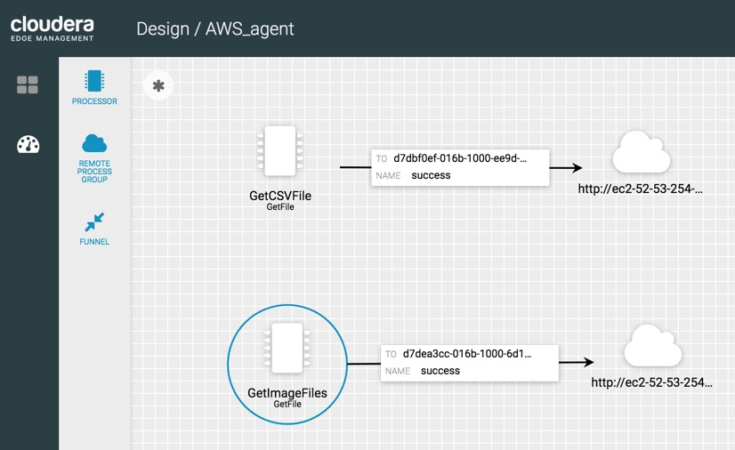

### Publish Data Flow to MiNiFi Agent

Click on publish in actions dropdown:

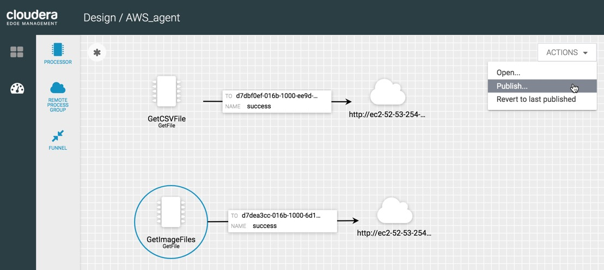

Make this flow available to all agents associated with **AWS_agent** class, press publish:

> Note: you can add comment `Sending driving log csv and image data to NiFi`

Result of published successful:

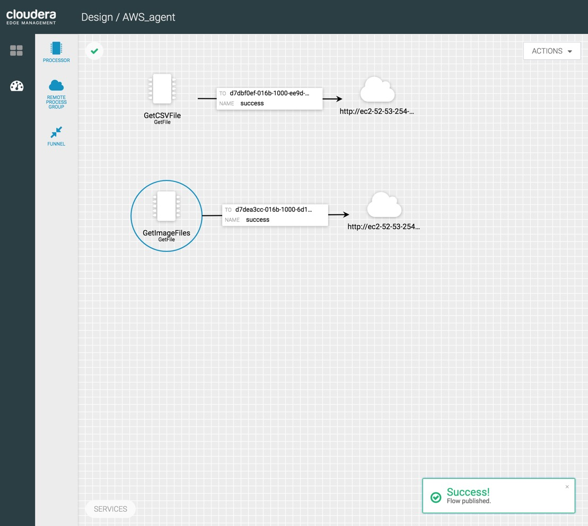
