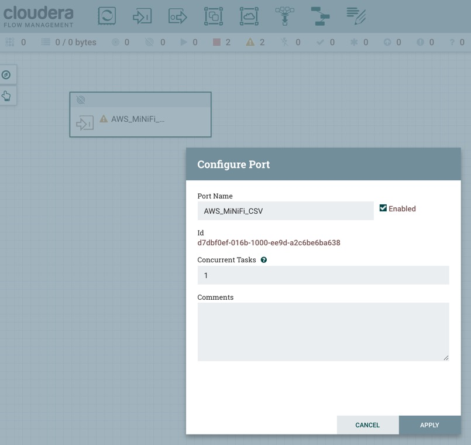
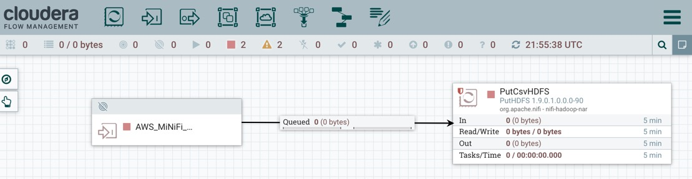
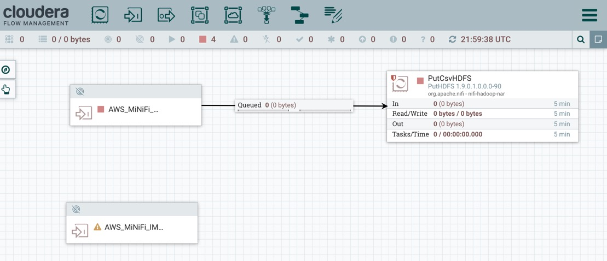
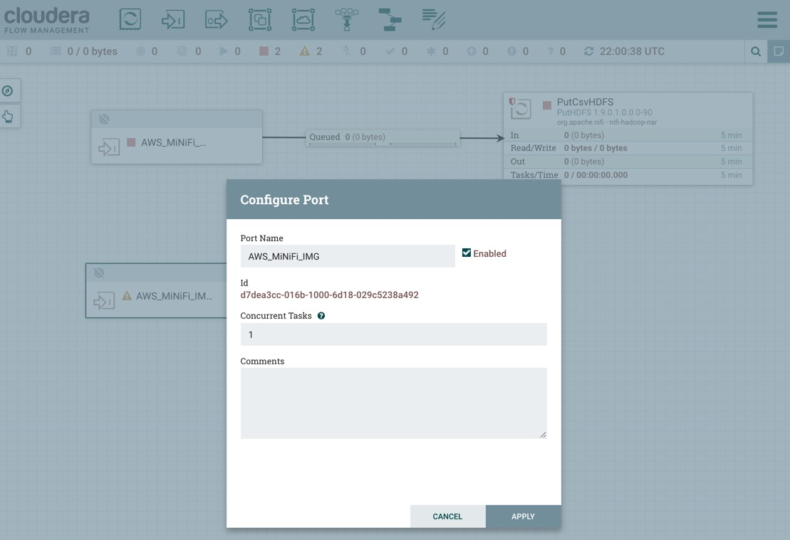
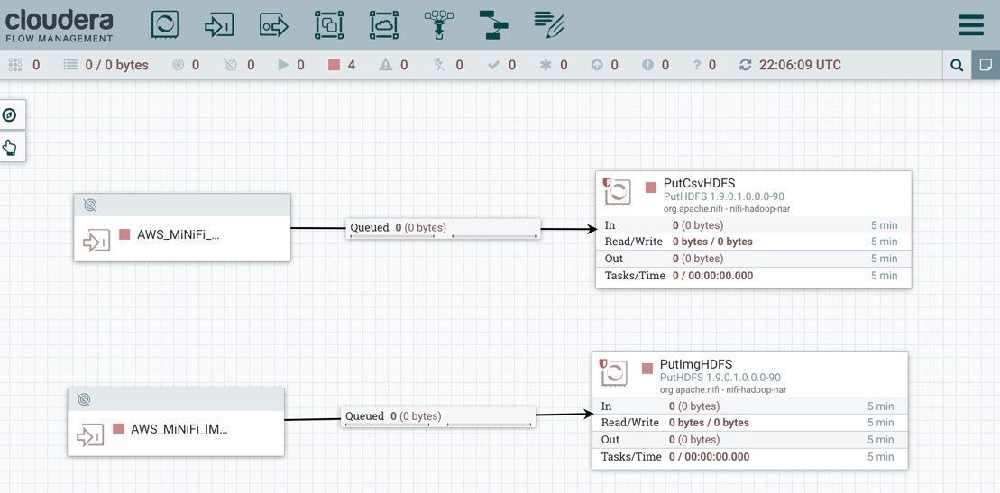
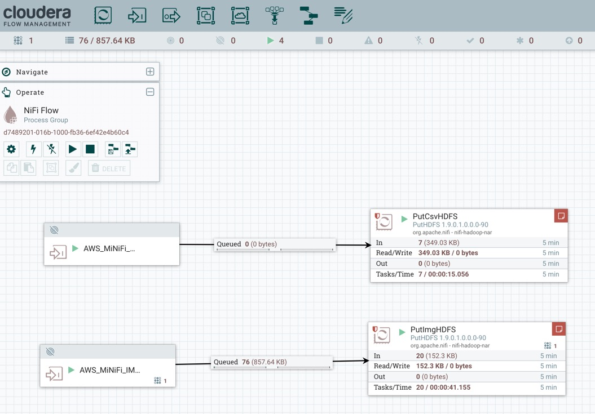
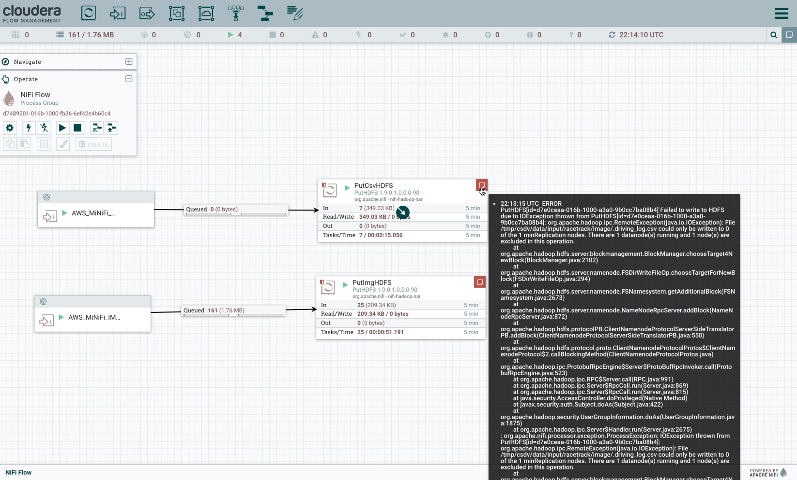

# Tutorial 2: Collect Car Edge Data into Cloud

We will use Cloudera Flow Manager (CFM) to build a NiFi dataflow in the interactive UI running in the cloud on an aws ec2 instance. This dataflow will be used to extract data from the MiNiFi agent, transform the data for routing csv and image data to HDFS running on another ec2 instance.

- Cloudera Flow Manager runs on port: `8080/nifi/`

`<cfm-ec2-public-dns>:8080/nifi/`

### Upload Hadoop HDFS Location to NiFi

SSH into EC2 instance running NiFi:

~~~bash
ssh -i /path/to/pem_file <os-name>@<public-dns-ipv4>
~~~

~~~bash
# download hdfs core-site.xml
mkdir -p /tmp/service/hdfs/
cd /tmp/service/hdfs/
wget https://raw.githubusercontent.com/james94/Autonomous-Car/master/documentation/assets/services/hadoop_hdfs/core-site.xml
~~~

Enter your CDH public host name in these field of core-site.xml:

~~~xml
  <property>
    <name>fs.defaultFS</name>
    <value>hdfs://{CDP Public DNS}:8020</value>
  </property>
~~~

Save core-site.xml.

## Build NiFi Flow to Load Data into HDFS

### Add Input Port for CSV Data Ingest from MiNiFi Agent

We will use the **input port** created on the previous section as an entry point for our flow onto NiFi:

>Note: Take note of **input port ID** under port details since we will need it for CEM UI to connect the MiNiFi processors to the NiFi RPG.

### Save CSV Input Port ID for MiNiFi CEM Flow

> Note: if you haven't added inport port id for csv data in your minifi flow, take this id above to your minifi flow.

### Connect and Load CSV to HDFS

Add a **PutHDFS** processor onto canvas to store driving log data. Update processor name to **PutCsvHDFS**.

Update the following processor properties:

| Property  | Value  |
|:---|---:|
| `Hadoop Configuration Resources` | `/tmp/service/hdfs/core-site.xml` |
| `Directory`  | `/tmp/csdv/data/input/racetrack/image/`  |

Connect the **AWS_MiNiFi_CSV** input port to **PutCsvHDFS** processor:

### Add Input Port for Image Data Ingest from MiNiFi Agent

If you haven't already Add an **input port** to extract image data from MiNiFi:

Take note of **input port ID** under port details since we will need it for CEM UI.

### Save Image Input Port ID for MiNiFi CEM Flow

> Note: if you haven't added inport port id for image data in your minifi flow, take this id above to your minifi flow.

### Connect and Load Images to HDFS

Add a **PutHDFS** processor onto canvas to store driving log data. Update processor name to **PutImgHDFS**.

Update the following processor properties:

| Property  | Value  |
|:---|---:|
| `Hadoop Configuration Resources` | `/tmp/service/hdfs/core-site.xml` |
| `Directory`  | `/tmp/csdv/data/input/racetrack/image/logitech`  |

Connect the **AWS_MiNiFi_IMG** input port to **PutImgHDFS** processor:

### Start NiFi Flow

Highlight all components on NiFi canvas with `ctrl+A` or `cmd+A`, then in the operate panel, press the start button:

You should see data flowing from NiFi to HDFS as above.

> Note: if you don't see data flowing, go back to the CEM UI, make sure you have your flow connected to this NiFi remote instance. Also make sure MiNiFi Agent is runnining.

Potential error you may see can be ignored:

