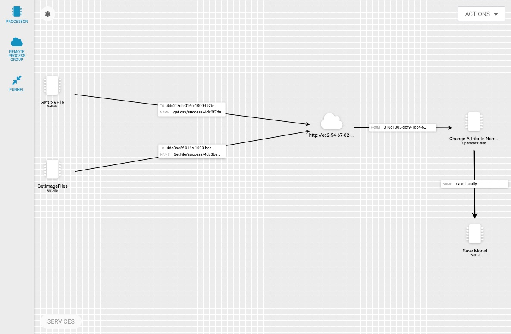

# Tutorial 3: AI to the edge

We will use Cloudera Data Platform to have access car data in Hadoop - HDFS for when we work in Cloudera Data Science Workbench (CDSW) and train the Keras CNN model. This access to HDFS will also allow us to save the model into HDFS from CDSW. CDSW will be running on the same ec2 instance as CDH and HDFS, but in its own docker container, [read more about CDSW and how it works](intro-to-cdsw).

Download the source code to train the model to your local computer

~~~bash
wget -O $HOME/hdfs-train.zip https://raw.githubusercontent.com/gdeleon5/Autonomous-Car/master/documentation/assets/src/hdfs-train.zip && unzip $HOME/hdfs-train.zip -d $HOME
~~~

now open an instance of Cloudera Data Science Workbench

- CDSW runs at web address:

 `http://cdsw.<cdp-public-cloud-dns>.nip.io`

Sign in to CDSW and select new project and name it CSDV

then select a local folder and upload the CSDV project you downloaded earlier:

Once the folder uploads to CDSW, open a new workbench:

when selecting to open a new workbench

>Note: that this model is light enough to be trained with a 4 vCPUs and 8GB of RAM

when you start the session click on the read me file and ensure the packages listed there are installed on your CDSW engine

now we can begin training our model, select the `hdfs-model.py` file on the CDSW file explorer, but before we can run the training script we must ensure that there is data flowing in to HDFS from our CEM cluster

enter the following command on the workbench:

`!hdfs dfs -ls /tmp/csdv/data/input/racetrack/image/logitech`

the output should show a few files stored into HDFS. However, if not all of the files you intended to send over are stored into HDFS yet, you should wait because the more data we have the better the model will be.

continue to wait until all of the files that were stored on the edge device have been moved to HDFS. Once all of the files have been moved and you have installed all of the dependencies you are ready to begin training

Now select the `hdfs-model.py` file and select `Run>Run All` your training should look like this

for more details about how the training works check out this [blog](link)

## Back to the Edge

### NiFi Setup

Now that you have a model stored on HDFS we can move it back to the edge to complete the cycle. Navigate to NiFi UI and create a new `GetHDFS` processor and connect it to an **output** port

Update the following processor properties:

**Table 7:** Update **GetHDFS** Properties

| Property  | Value  |
|:---|:---|
| `Hadoop Configuration Resources` | `/tmp/service/hdfs/core-site.xml` |
| `Directory`  | `/tmp/csdv/output/`  |
| `Recurse Subdirectories`  |  `false`  |
| `Keep Source File` | `True` |
your NiFi canvas should look like this

### CEM Setup

Now navigate to CEM UI and drop a new `UpdateAttribute` processor and add the following properties

**Table 8:** Properties for UpdateAttribute processor

| Porperty  | Value  |
|:---|:---|
|`Processor Name`|`Change Attribute Name`|
|`filename` | `model.h5` |
|`Scheduling Strategy`| `Event Driven`|
|`Concurrent Tasks`| `1`|

Connect the RPG to `Change Attribute Name`, then add the NiFi origin input port ID you want to send the csv data:

**Table 9:** Add **Output Port ID** for RPG connection

| Settings  | Value  |
|:---|---:|
| `Source Output Port ID` | `<NiFi-Output-port-ID>` |

Your canvas should now look similar to this:

Now drop a new `PutFile` processor onto the canvas and name it **Save Model** then enter these properties:

**Table 9:** Properties for PutFile processor

| Porperty  | Value  |
|:---|:---|
|`Processor Name` | `Save Model` |
|`Create Missing Directories`|`True`|
| `Directory`  | `/tmp/fromHDFS/model/` |

Connect `Change Attribute Name` to `Save Model`, then add the NiFi origin input port ID you want to send the csv data:

once you are finished your flow should look like this

Next select **Action** and publish the MiNiFi flow. Finally, open the NiFi UI and start the processors to begin the flow of the model back into the edge device.

We can simply move the model into the location where ROS is expecting it to be and run CDSV with our new AI.

## Conclusion

We began the Edge to AI journey with raw data and ended with a practical Machine Learning model back into the device which was used to collect the data itself, with automation scripts we may use this model to enable the car to drive autonomously while we stream even more data to HDFS to continue the training process. Further, we may author a flow which deploys the same model across a fleet of autonomous vehicles this vehicles in turn can share the different data that they all gather to improve the model even further. With this tutorial you now know how to build your own Edge to AI cycle we are exited to see what your create with this new knowledge, you can share your experiments and creations on the new [Cloudera Community](link).
