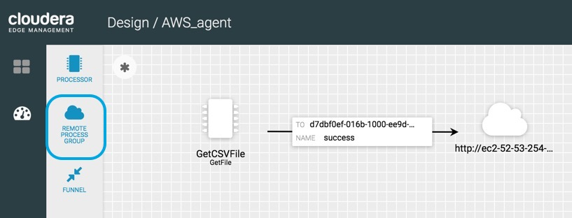

## Tutorial 1: Ingest Car Sensor Data on Edge

We will use Cloudera Edge Manager (CEM) to build a MiNiFi dataflow in the interactive UI and publish it to the MiNiFi agent running on the edge. This dataflow will ingest the car sensor data coming from ROS and push it to NiFi running in the cloud.

- Cloudera Edge Manager runs on port: `10080/efm/ui`

`<cem-ec2-public-dns>:10080/efm/ui`

### Build Data Flow for MiNiFi via CEM UI

The CEM events page will open:

Click on Flow Designer, you can click on the class associated with MiNiFi agent you want to build the dataflow for. 

> Note: Later when MiNiFi C++ agent deployed on separate the Jetson TX2, the class called **"CSDV_agent"** will appear.

For now click class **AWS_agent**. Press open to start building. The canvas opens for building flow for class **AWS_agent**:

We will build a MiNiFi ETL pipeline to ingest csv and image data.

### Add a GetFile for CSV Data Ingest

Add a **GetFile** processor onto canvas to get csv data:

Update processor name to **GetCSVFile**.

Double click on GetFile to configure. Scroll to **Properties**, add the properties in Table 1 to update GetFile's properties.

**Table 1:** Update **GetCSVFile** Properties

| Property  | Value  |
|:---|---:|
| `Input Directory`  | `/tmp/csdv/data/input/racetrack/image`  |
| `Keep Source File`  | `false`  |
| `Recurse Subdirectories` | `false` |

### Push CSV Data to Remote NiFi Instance

Add a **Remote Process Group** onto canvas to send csv data to NiFi remote instance:

Add URL NiFi is running on:

| Settings  | Value  |
|:---|---:|
| `URL` | `http://<ec2-public-DNS>:8080/nifi/` | 

Connect **GetCSVFile** to Remote Process Group, then add the NiFi destination input port ID you want to send the csv data:

| Settings  | Value  |
|:---|---:|
| `Destination Input Port ID` | `<NiFi-input-port-ID>` | 

> Note: you can find the input port ID by clicking on your input port in the NiFi flow. Make sure you connect to the input port that sends csv data to HDFS.

### Add a GetFile for Image Data Ingest

Add a **GetFile** processor onto canvas to get image data:

Update processor name to **GetImageFiles**.

Double click on GetFile to configure. Scroll to **Properties**, add the properties in Table 2 to update GetFile's properties.

**Table 2:** Update **GetFile** Properties

| Property  | Value  |
|:---|---:|
| `Input Directory`  | `/tmp/csdv/data/input/racetrack/image/logitech`  |
| `Keep Source File`  | `false`  |

### Push Image Data to Remote NiFi Instance

Add a **Remote Process Group** onto canvas to send image data to NiFi remote instance:

| Settings  | Value  |
|:---|---:|
| `URL` | `http://<ec2-public-DNS>:8080/nifi/` | 

Connect **GetImageFiles** to Remote Process Group, then add the following configuration:

| Settings  | Value  |
|:---|---:|
| `Destination Input Port ID` | `<NiFi-input-port-ID>` | 

> Note: you can find the input port ID by clicking on your input port in the NiFi flow. Make sure you connect to the input port that sends image data to HDFS.

### Publish Data Flow to MiNiFi Agent

Click on publish in actions dropdown:

Make this flow available to all agents associated with **AWS_agent** class, press publish:

> Note: you can add comment `Sending driving log csv and image data to NiFi`

Result of published successful:

